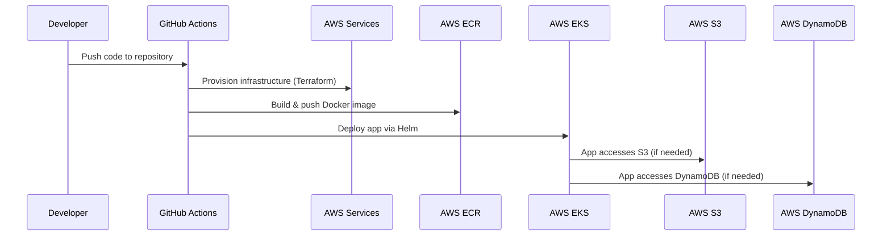

# Project: Sample API App

## Overview

This repository contains infrastructure-as-code, application code, and deployment configurations for a sample API application. It supports both local Kubernetes (Minikube) and cloud (AWS EKS) deployments, with CI/CD automation via GitHub Actions.


## Architecture Diagram

```
## Deployment Sequence Diagram




Legend:
- Local: Developer can run Minikube and test locally.
- Cloud: GitHub Actions automates provisioning (Terraform), builds/pushes Docker images (ECR), and deploys to EKS (Helm).
- EKS runs the API pods, which can use AWS services (S3, DynamoDB, etc.).
```


## Folder Structure

```
.github/                  # GitHub Actions workflows for CI/CD
apps/
  sample-api/             # Flask API application (Dockerized)
    src/                  # Application source code
    tests/                # Unit/integration tests
    Dockerfile            # Docker build file for the API
deploy/
  helm/                   # Helm charts for Kubernetes deployments
    pips-api/             # Helm chart for pips-api
    sample-api/           # Helm chart for sample-api
  kustomize/              # (Optional) Kustomize overlays
diagrams/                 # Architecture diagrams
infra/
  envs/
    dev/                  # Terraform environment for dev
    prod/                 # Terraform environment for prod
  modules/                # Terraform modules (vpc, eks, ecr, iam)
local-k8s/
  app/                    # (Optional) Local app code
  manifests/              # Raw Kubernetes manifests for local use
  terraform/              # Terraform for local Kubernetes resources
  commands.txt            # Useful local Kubernetes commands
```

---

## Prerequisites

- [Docker](https://www.docker.com/)
- [kubectl](https://kubernetes.io/docs/tasks/tools/)
- [Helm](https://helm.sh/)
- [Terraform](https://www.terraform.io/)
- [AWS CLI](https://aws.amazon.com/cli/)
- [Minikube](https://minikube.sigs.k8s.io/) (for local runs)
- AWS Account with permissions for EKS, ECR, VPC, IAM, S3, DynamoDB

---

## Local Development & Testing

### 1. Start Minikube

```sh
minikube start --profile=pips-api-cluster
```

### 2. Build and Run the API Locally

```sh
cd local-k8s/app
docker build -t pipeloluwa/simple-api:latest .
docker push pipeloluwa/simple-api:latest

```

### 3. Deploy to local Kubernetes using Terraform

```sh
cd local-k8s/terraform
terraform init
terraform plan
terraform apply
```


### 4. Access the API

- Get Minikube IP:
  ```sh
  minikube ip --profile=pips-api-cluster
  ```
- Port-forward:
  ```sh
  kubectl port-forward svc/pips-api -n test 5000:5000
  ```
- Visit: [http://localhost:5000/health](http://localhost:5000/)

---

## Cloud Deployment (AWS EKS)

## CI/CD Pipeline

The cloud deployment process is fully automated using a GitHub Actions workflow defined in [`.github/workflows/deploy.yml`](.github/workflows/deploy.yml). This pipeline ensures that infrastructure provisioning, application build, and deployment are consistent and repeatable.

### Pipeline Overview

On every push or pull request to the `main` branch, the workflow performs the following steps:

1. **Checkout Code**
   - Checks out the repository code to the GitHub Actions runner.

2. **Configure AWS Credentials**
   - Uses OIDC (OpenID Connect) to securely authenticate to AWS without storing static credentials.
   - Sets up environment variables for Terraform and AWS CLI.

3. **Terraform Provisioning**
   - Initializes Terraform in the appropriate environment directory (e.g., `infra/envs/dev`).
   - Runs `terraform plan` to preview infrastructure changes.
   - Applies the Terraform plan to provision or update AWS resources (VPC, EKS, ECR, IAM, etc.).

4. **Docker Build & Push**
   - Builds the Docker image for the API using the Dockerfile in `apps/sample-api/`.
   - Tags the image with the latest commit SHA or a version tag.
   - Authenticates to AWS ECR.
   - Pushes the built image to the ECR repository.

5. **Helm Deployment**
   - Updates the Kubernetes context to point to the newly provisioned EKS cluster.
   - Uses Helm to deploy or upgrade the application using the chart in `deploy/helm/pips-api`.
   - Passes in environment-specific values (e.g., image tag, environment variables).


### Example Workflow Steps

```yaml
# .github/workflows/deploy.yml (simplified)
jobs:
  deploy:
    runs-on: ubuntu-latest
    steps:
      - uses: actions/checkout@v4

      - name: Configure AWS credentials
        uses: aws-actions/configure-aws-credentials@v4
        with:
          role-to-assume: ${{ secrets.AWS_ROLE_ARN }}
          aws-region: us-east-1

      - name: Terraform Init & Apply
        run: |
          cd infra/envs/dev
          terraform init
          terraform plan -out=tfplan
          terraform apply -auto-approve tfplan

      - name: Build & Push Docker Image
        run: |
          aws ecr get-login-password --region us-east-1 | docker login --username AWS --password-stdin <account_id>.dkr.ecr.us-east-1.amazonaws.com
          docker build -t sample-api:${{ github.sha }} ./apps/sample-api
          docker tag sample-api:${{ github.sha }} <account_id>.dkr.ecr.us-east-1.amazonaws.com/sample-api:${{ github.sha }}
          docker push <account_id>.dkr.ecr.us-east-1.amazonaws.com/sample-api:${{ github.sha }}

      - name: Update kubeconfig
        run: aws eks update-kubeconfig --name sample-dev --region us-east-1

      - name: Helm Deploy
        run: |
          helm upgrade --install pips-api ./deploy/helm/pips-api \
            --namespace pips --create-namespace \
            --set image.tag=${{ github.sha }} \
            --values ./deploy/helm/pips-api/values-dev.yaml
```

### Key Features

- **End-to-End Automation:** No manual steps required for cloud deployment.
- **Security:** Uses OIDC for AWS authentication, avoiding static credentials.
- **Repeatability:** Ensures infrastructure and application deployments are consistent across environments.
- **Traceability:** Each deployment is linked to a specific commit SHA.

---

## Useful Commands

See [local-k8s/commands.txt](local-k8s/commands.txt) for common local Kubernetes commands.

---

## Customization

- **Helm values:** Override chart values in `deploy/helm/pips-api/values.yaml` or via `--values` flag.
- **Terraform variables:** Set in `infra/envs/dev/terraform.tfvars` or `prod/terraform.tfvars`.

---

## Troubleshooting

- Ensure all prerequisites are installed and configured.
- For AWS, verify IAM permissions and region settings.
- For local runs, ensure Minikube is running and Docker is using the Minikube Docker daemon if needed.

---

## Author

- Pipeloluwa Praise Adebayo

---

## References

- [Kubernetes Documentation](https://kubernetes.io/docs/)
- [Helm Documentation](https://helm.sh/docs/)
- [Terraform AWS Provider]